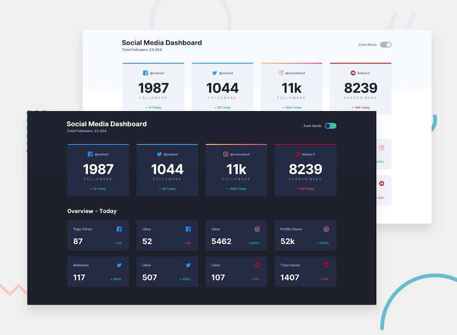

<p align="center">
  
</p>


# Social Media Dashboard

**Live demo:** https://tailwind-react-social-dashboard.vercel.app

A static social media dashboard UI (followers per network plus an
"Overview - Today" grid) with a light/dark mode toggle. Built with Create
React App, Tailwind CSS 3 (class-based dark mode) and `react-icons`. The
numbers are placeholder data.

## Getting started

```bash
npm install
npm start        # dev server on http://localhost:3000
```

## Scripts

| Command | What it does |
| --- | --- |
| `npm start` | Start the development server |
| `npm test` | Run the Jest + Testing Library tests |
| `npm run build` | Production build into `build/` |

Tailwind is configured in `tailwind.config.js` (custom brand colors and
dark palette) and wired through `postcss.config.js`.
